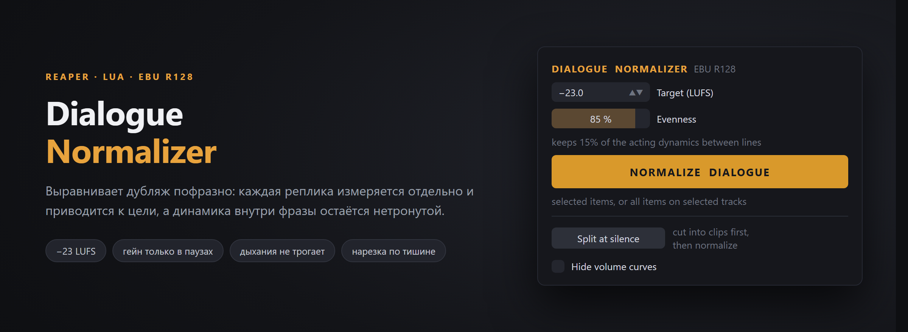

# Dialogue Normalizer

Скрипт для REAPER: выравнивает громкость диалогов пофразно, по EBU R128.

Скрипт находит каждую произнесённую фразу, измеряет её отдельно и приводит целиком к цели — по умолчанию −23 LUFS. Динамика **внутри** фразы не трогается: никакого райдинга и накачки. Изменения гейна происходят только в паузах, в самой тихой их точке, где они не слышны.

Дыхания, комнатный тон и шум распознаются по отсутствию слоговой модуляции и никогда не нормализуются сами по себе — они сохраняют гейн соседней фразы.

## Настройки

**Target (LUFS)** — цель, к которой приводятся фразы. По умолчанию −23.

**Evenness** — насколько убрать разброс уровней между репликами. На 100 % каждая фраза попадает в цель точно; ниже — часть актёрской динамики между репликами сохраняется. По умолчанию 85 %.

## Split at silence

Режет запись на клипы по одной фразе и убирает комнатный тон между ними — с запасом до и после, фейдами и отслеживанием затухающего хвоста, чтобы не срезать окончания слов и дыхания.

Рекомендуется делать **до** нормализации: результат выравнивания одинаков в любом порядке, но без тишины не остаётся фонового шума, который поднимется вместе с тихими репликами.

## Область работы

Выделенные куски диалогов или целая дорожка; если ничего не выделено — все кусочки на выделенных дорожках.

## Установка

1. Скачайте `ALV_Dialogue_Leveler.lua`.
2. В REAPER: `Actions → Show action list → New action → Load ReaScript`.
3. Выберите файл и назначьте на удобную клавишу.

Интерфейс требует [ReaImGui](https://github.com/cfillion/reaimgui). Без него скрипт всё равно работает — запускается сразу с сохранёнными настройками и показывает отчёт обычным окном.

## Лицензия

MIT — см. [LICENSE](LICENSE).
